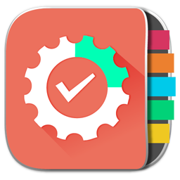

<p align="center">
  
</p>

# Task Manager App

Welcome to the **Task Manager App** repository! This project was developed as part of an interview task to demonstrate proficiency in **React Native** development, state management, and implementing core app features. It includes task management, post listing with pagination, theme toggling, and a form screen, adhering to the provided requirements while showcasing professional coding practices and clean architecture.

---

## 🚀 Features

### **1. Task Management Screen**
- **Add Tasks**: Users can add tasks by entering text.
- **View Tasks**: Tasks are displayed in a clean, user-friendly list.
- **Delete & Restore**: 
  - Deleted tasks are moved to the bottom of the list with an option to restore them.
- **Mark as Completed**: Users can mark tasks as completed (Bonus feature).
- **Local Persistence**: Tasks are stored locally for persistence across sessions.

### **2. Post List with Pagination**
- **Fetch Data**: Retrieves posts from [JSONPlaceholder](https://jsonplaceholder.typicode.com/).
- **Pagination**: Custom implementation of pagination without any third-party libraries to display posts in chunks of 10.
- **Dedicated Post Screen**: Users can tap a post to view its details on a separate screen.

### **3. Light/Dark Theme**
- **Dynamic Theming**: Implements light and dark themes.
- **System Theme Detection**: Automatically detects and applies the user's system theme during the app launch.
- **User Toggle**: Users can toggle between light and dark themes from the app.

### **4. Form Screen**
- **Form Inputs**: Allows users to:
  - Upload a picture.
  - Enter their name and email.
- **On Submission**: 
  - Displays a success message.
  - Redirects the user to the home screen.
  - Shows the submitted data in a modal for review.

### **5. State Management**
- Uses centralized state management to handle the app's tasks, posts, and theme.

---

## 🛠️ Tech Stack

### **Core Technologies**
- **React Native**: Framework for building cross-platform mobile apps.
- **Context API**: For efficient state management.
- **AsyncStorage**: To persist tasks and settings locally.

---

## 📂 Directory Structure

```plaintext
src/
├── app/             # Screens/Navigations for Task Manager, Post List, Form, etc.
├── context/         # Context API for state management
├── components/      # Reusable UI components
├── constants/       # Constants used throughout the app
├── assets/          # Images, icons, etc.
└── hooks            # Applications Custom hooks
```

---

## 🔧 Installation and Setup

Follow these steps to set up the app locally:

1. **Clone the repository**:
   ```bash
   git clone https://github.com/AsadAnik/task-app.git
   cd task-app
   ```

2. **Install dependencies**:
   ```bash
   npm install
   ```

3. **Run the app**:
   ```bash
   npm start
   ```
   Open the app on an Android or iOS emulator, or use a physical device.

---

📥 Download APK
You can download and test the APK directly from the link below:
[Download APK](https://drive.google.com/file/d/1dxX8bvsFl_gwEs7PGreXPMJ7xkp5xxeO/view?usp=drive_link)

---

## 📸 Screenshots

| **Task Management**              | **Post List with Pagination**  | **Form Screen**           |
|----------------------------------|--------------------------------|---------------------------|
|  |  |  |

---

## 🌟 Highlights

- **Professional Coding Practices**: The app is built with clean architecture, modular components, and reusable styles.
- **No Third-Party Libraries**: Implements pagination and state management natively, showcasing a strong understanding of React Native's core capabilities.
- **Dynamic Theme**: A seamless light/dark theme switcher enhances user experience.
- **Local Storage**: Ensures user data persistence for a professional app experience.

---

## 🧩 How It Works

### **Task Management**
- Tasks are stored in the context state and persisted using `AsyncStorage`.
- Deleted tasks are filtered and displayed separately, with an option to restore them.

### **Post Pagination**
- Fetches posts using `fetch` and displays them in chunks of 10.
- Pagination is handled using internal state to manage visible posts.

### **Theme Management**
- Detects the system theme using `Appearance.getColorScheme()`.
- Provides a toggle feature to switch themes manually.

### **Form Functionality**
- On form submission:
  - Data is displayed in a modal.
  - User is redirected to the home screen.

---

## 📖 Future Improvements

- Add **unit and integration tests** for better code coverage.
- Enhance UI/UX with animations and transitions.
- Implement **offline support** for posts using a caching mechanism.

---

## 🤝 Acknowledgments

Special thanks to the interview panel for providing this engaging task. It allowed me to demonstrate not only my technical skills but also my problem-solving approach and attention to detail.

---

Feel free to reach out for further clarifications or improvements. Thank you for reviewing my project! 😊